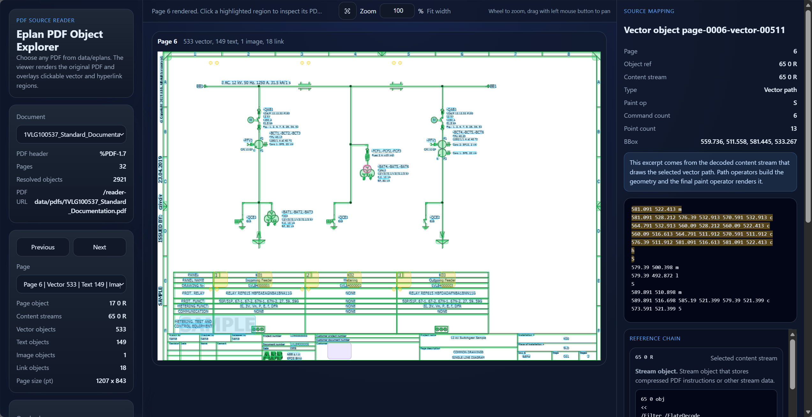

# EplanMaster

`EplanMaster` 是一个面向 Eplan / 工程类 PDF 的解析与可视化工具仓库，当前包含两条主要能力：

- Python 侧 PDF 预处理与结构解析
- 前端 `pdf_reader`，用于查看 PDF 页面、叠加矢量/文字/链接对象，并回看对应的 PDF 源片段

项目目前的 PDF 解析核心逻辑是自定义实现的，主要位于：

- [scripts/inspect_eplan_pdfs.py](scripts/inspect_eplan_pdfs.py)
- [scripts/build_pdf_reader_data.py](scripts/build_pdf_reader_data.py)

前端 PDF 渲染使用：

- `pdfjs-dist`

## Frontend Preview

下面这张图用于展示 `pdf_reader` 的前端界面效果：



## 仓库结构

```text
EplanMaster/
├─ docs/                     # README 用到的图片与附加文档
├─ scripts/                  # PDF 解析、检查、前端数据生成脚本
├─ pdf_reader/               # Vite + TypeScript 前端阅读器
├─ data/                     # 放原始 PDF，默认不提交
├─ output/                   # inspect 输出目录，默认不提交
├─ environment.yml           # Python 环境定义
└─ README.md
```

## 环境要求

建议使用下面这套环境：

- Python 3.13
- Node.js 20+
- npm 10+

当前 `environment.yml` 内容非常轻量，Python 侧主要依赖标准库。

## 1. 搭建 Python 环境

### 使用 conda

在仓库根目录运行：

```powershell
conda env create -f environment.yml
conda activate Eplan
```

如果环境已经存在：

```powershell
conda activate Eplan
```

### 不使用 conda

也可以直接使用本机 Python 3.13：

```powershell
python --version
```

只要版本兼容，脚本通常也可以直接运行。

## 2. 搭建前端环境

进入前端目录并安装依赖：

```powershell
cd pdf_reader
npm install
cd ..
```

## 3. 准备原始 PDF

默认输入目录是：

```text
data/eplans
```

如果目录不存在，先创建：

```powershell
New-Item -ItemType Directory -Force data\eplans
```

然后把待处理的 PDF 放进去，例如：

```text
data/eplans/demo.pdf
```

## 4. 生成前端所需的预处理数据

在仓库根目录运行：

```powershell
python scripts/build_pdf_reader_data.py
```

默认行为：

- 输入目录：`data/eplans`
- 输出目录：`pdf_reader/public/reader-data`

这个脚本会：

- 扫描 `data/eplans` 下所有 `*.pdf`
- 复制 PDF 到前端静态目录
- 解析页面中的矢量路径、文字、图片、链接等对象
- 生成 `manifest.json`
- 为每个 PDF 的每一页生成结构化 JSON

如果你新增、替换或删除了 PDF，需要重新执行这一步。

## 5. 启动前端阅读器

进入前端目录后运行：

```powershell
cd pdf_reader
npm run dev
```

启动后按终端输出打开本地地址，通常是：

```text
http://localhost:5173
```

## 从零开始的完整运行流程

如果是第一次在新机器上运行，推荐直接按下面的顺序执行：

```powershell
git clone <your-repo-url>
cd EplanMaster

conda env create -f environment.yml
conda activate Eplan

cd pdf_reader
npm install
cd ..

New-Item -ItemType Directory -Force data\eplans
# 然后把 PDF 放到 data/eplans/

python scripts/build_pdf_reader_data.py

cd pdf_reader
npm run dev
```

## 可选：生成 PDF 检查报告

如果你想单独查看 PDF 的原始对象结构和检查输出，可以运行：

```powershell
python scripts/inspect_eplan_pdfs.py
```

默认行为：

- 输入目录：`data/eplans`
- 输出目录：`output/pdf_inspection`

主要输出包括：

- `output/pdf_inspection/README.md`
- `output/pdf_inspection/index.json`
- `output/pdf_inspection/<pdf-name>/overview.md`
- `output/pdf_inspection/<pdf-name>/summary.json`
- `output/pdf_inspection/<pdf-name>/pages_readable.json`

这个步骤不是前端运行的必需步骤，但对调试 PDF 结构很有帮助。

## 常用命令

### 重新生成前端数据

```powershell
python scripts/build_pdf_reader_data.py
```

### 启动前端开发环境

```powershell
cd pdf_reader
npm run dev
```

### 前端生产构建

```powershell
cd pdf_reader
npm run build
```

### 单独生成 PDF 检查输出

```powershell
python scripts/inspect_eplan_pdfs.py
```

## 开源前建议

如果你准备把这个仓库公开，建议在发布前确认下面几件事：

- 确认 `data/` 下没有不方便公开的原始 PDF
- 确认 `output/` 下没有调试产物需要提交
- 确认 `pdf_reader/public/reader-data` 中的示例数据允许公开
- 选择并添加一个明确的开源许可证

当前仓库里还没有替你擅自添加许可证文件，因为这属于有法律后果的选择，建议你根据发布目标自行决定，例如 MIT、Apache-2.0 或 GPL 系列。

## 说明

- Python 预处理脚本主要依赖标准库
- 前端是 Vite + TypeScript
- PDF 页面渲染由 `pdfjs-dist` 完成
- 某些 PDF 的文字编码、字体映射和对象流格式比较特殊，解析结果可能需要继续迭代
